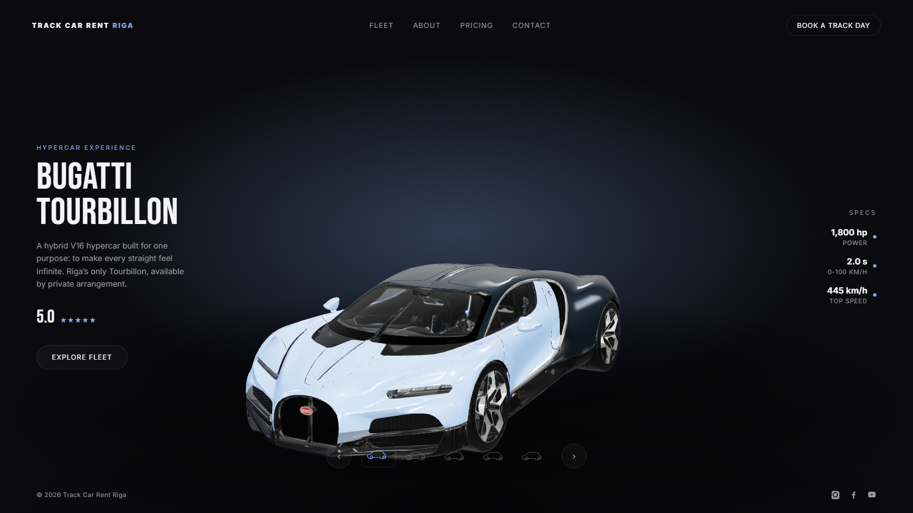
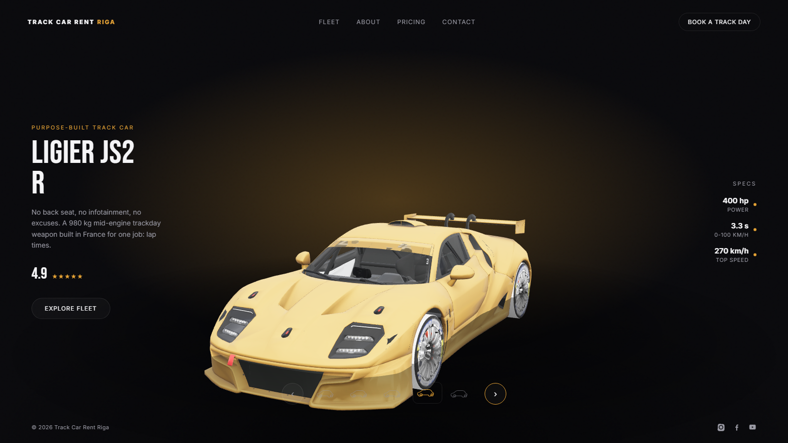
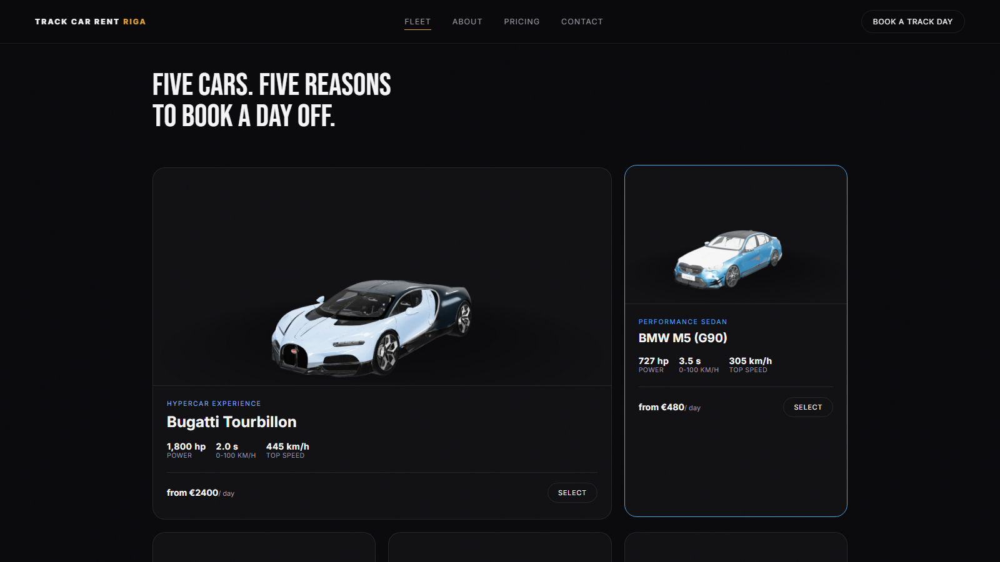
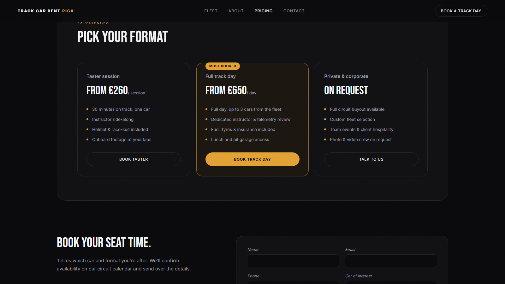
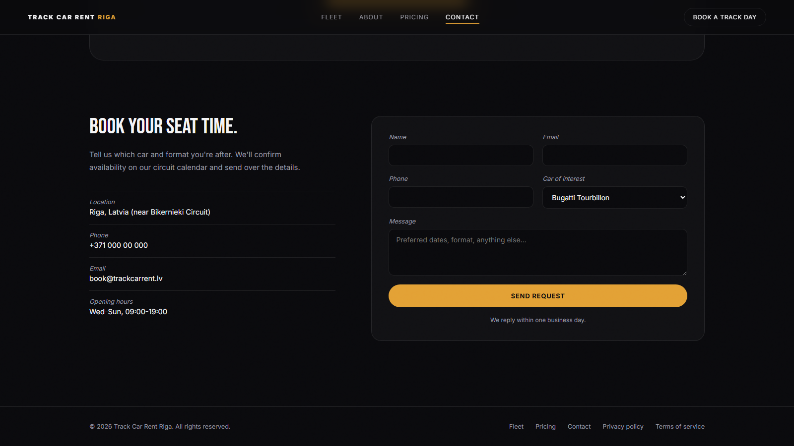
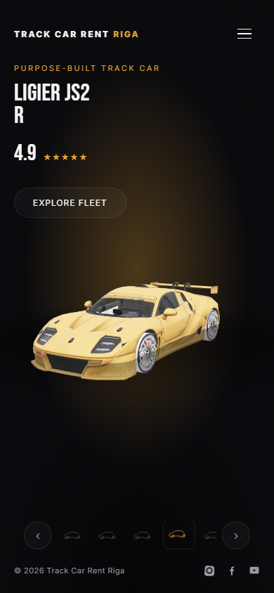

# Track Car Rent Riga

Landing page for a track-day and supercar rental business in Riga, Latvia. Built around an
interactive 3D car showcase — visitors rotate, compare, and explore the fleet in the browser
before booking a track day.

> This is a showcase-only repository. Source code lives in a private repo; screenshots and a
> description of the build live here.

## Highlights

- **Interactive 3D hero showcase** — five real car models (Bugatti Tourbillon, BMW M5, Audi RS6
  GT Avant, Ligier JS2 R, Buick Riviera) rendered live in-browser, each with its own accent
  color, spec sheet, and rating. Drag to orbit, auto-rotating turntable, carousel navigation
  between cars.
- **Fleet, pricing, and contact sections** — full landing page beyond the hero: fleet gallery
  with auto-generated 3D render thumbnails, session/day-rate pricing tiers, and a booking form.
- **Performance-tuned 3D pipeline** — source models (Sketchfab-grade, multi-million vertices)
  reduced ~75% via mesh simplification, compressed with Draco (geometry) and WebP (textures),
  bringing the full 5-car fleet under 15MB while keeping visual fidelity.
- **Accessibility & motion** — `prefers-reduced-motion` support throughout (3D auto-rotate,
  transitions, scroll), 44px minimum touch targets, visible focus states, semantic HTML.

## Stack

- **Build:** [Vite](https://vitejs.dev/) — vanilla JS/ES modules, no framework
- **3D:** [Three.js](https://threejs.org/) — GLTFLoader + DRACOLoader, PBR materials,
  image-based lighting (PMREM + RoomEnvironment), CanvasTexture-based contact shadows
- **Models:** GLB, optimized with [gltf-transform](https://gltf-transform.dev/) (simplify →
  WebP texture compression → Draco geometry compression)
- **Fonts:** self-hosted via `@fontsource` (Inter for UI, Bebas Neue for display headlines)
- **Styling:** hand-written CSS, custom-property-driven theming (per-car accent color swaps
  live via a single CSS variable)

## Architecture notes

- Each car's 3D model is loaded once and cached; switching cars after the initial preload is
  instant (no reload), with a scale/slide transition and a brief loading-pulse cue.
- Car paint color, UI accent, ambient glow, and active-nav-link underline are all driven by one
  `--accent` CSS custom property, swapped per selected car.
- A background pass renders each cached model once at load time to generate WebP thumbnails for
  the fleet grid, so no separate asset pipeline is needed for preview images.

## Screenshots

**Hero showcase — Bugatti Tourbillon**

**Hero showcase — Ligier JS2 R** (per-car accent color and paint)

**Fleet gallery**

**Pricing**

**Contact / booking**

**Mobile**

